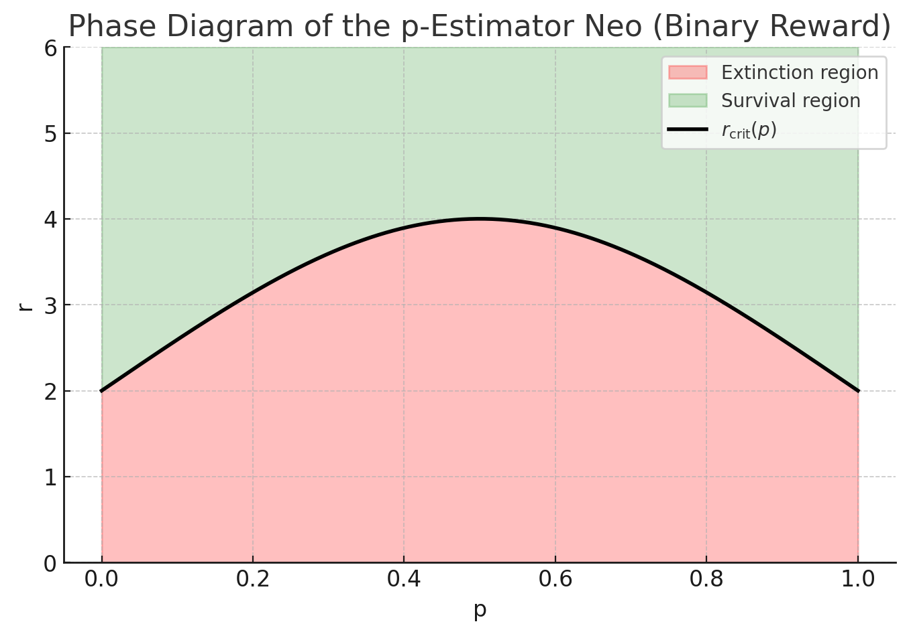
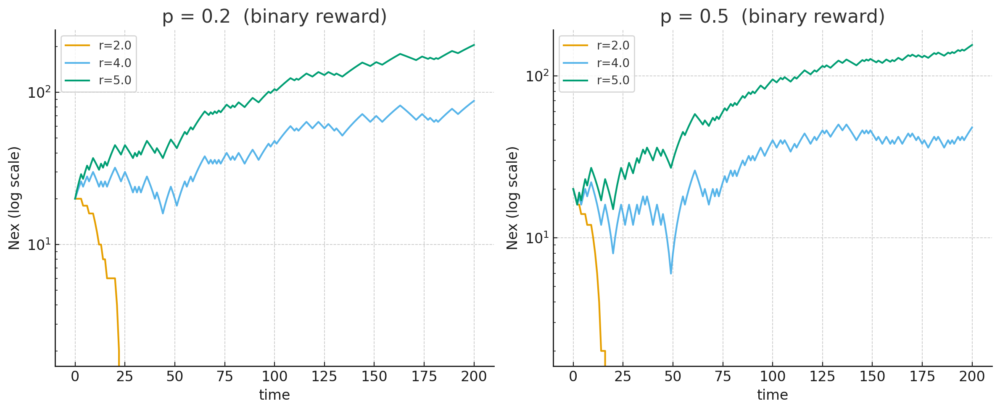

# Chapter 4 — Micro Static Analysis of a Single Neo

A Neo survives by predicting the NeoVerse (NV). At every tick, it receives a small snapshot of the world—$$m$$ binary inputs $$U_t \in \{0,1\}^m$$—and updates its internal state according to the Lex rule. From this updated state it produces an output vector $$Y_t$$, interpreted as its prediction of the next NV state $$U_{t+1}$$. Correct predictions generate Sparks, which increase the Neo's Nex. Regardless of correctness, each update consumes a fixed amount of Nex simply to remain alive.

In the broader Neosis framework, a Neo may improve its predictive ability through in-life plasticity or through evolutionary processes. However, this chapter focuses on the static case, where the Neo's structure and parameters are fixed. In this setting, the Neo does not adjust its weights or topology; it behaves exactly according to the computation encoded in its architecture at birth.

Because the computation is fixed, the Neo eventually settles into a long-run statistical pattern determined entirely by its structure and by the statistics of the NV. Its internal states, its outputs, and their relationship to NV inputs become time-invariant. This is the stationary regime of a Neo, and understanding this regime is the central goal of micro analysis.

The purpose of this chapter is to determine how much predictive ability a fixed Neo possesses purely from its stationary behavior. By characterizing how its stationary output relates to the NV's stationary dynamics, we can determine its expected Nex gain, its expected Nex loss, and ultimately whether it will survive.

## 4.1 Neo as a Predictive System

Prediction is only meaningful when the environment exhibits stable statistical structure. If the NeoVerse changed its distribution over time—drifting, aging, or altering its transition rules—then a static Neo could not maintain predictive accuracy. Even though learning-capable Neos will be treated later, the static Neo analyzed here can only exploit whatever statistical regularities are already present. Its predictive power depends entirely on whether the relationship between $$U_t$$ and $$U_{t+1}$$ remains consistent over time.

For this reason, we assume that the projection of the NeoVerse that a Neo perceives is a stationary stochastic process. As discussed in earlier chapters, a Neo does not experience the full NeoVerse; it only receives a limited projection of it through its m-bit input channel. It is this projected process, not the full NV, that must exhibit stable statistics. Stationarity does not require periodicity. A process may vary dramatically from moment to moment and still be stationary if its probability distribution does not change over time. What matters is that

$$P(U_t = u) = P(U_{t+1} = u) \quad \text{and} \quad P(U_{t+1} \mid U_t) \text{ is independent of } t.$$

Under this assumption, the joint distribution of the Neo's internal state and the current NV input,

$$\pi(x, u) = \lim_{t \to \infty} P(X_t = x, \, U_t = u),$$

converges to a well-defined stationary distribution. All predictive properties of the Neo derive from this object. Its output distribution is obtained by marginalizing the internal state, and its predictive performance is obtained by examining how its stationary output relates to the NV's next state.

A stationary NV therefore makes micro analysis possible: it ensures that a fixed Neo has a well-defined, time-invariant predictive relationship with the environment.

## 4.2 Neo's Survivability

Once the Neo and the perceived NeoVerse (NV) projection settle into their joint stationary regime, their long-run behavior is captured by the stationary distribution

$$\pi(x, u) = \lim_{t \to \infty} P(X_t = x, \, U_t = u),$$

where $$X_t$$ is the Neo's internal state and $$U_t \in \{0,1\}^m$$ is the $$m$$-bit NV projection it sees at time $$t$$. The Neo's output is a fixed readout of its state,

$$Y_t = g(X_t),$$

and the NV projection evolves according to a time-invariant transition law

$$P(U^+ = u' \mid U = u),$$

where $$U^+ = U_{t+1}$$ denotes the next NV projection the Neo is trying to predict.

Starting from $$\pi(x, u)$$, the distribution of outputs in the stationary regime is obtained by marginalizing over the internal state and input:

$$P(Y = y) = \sum_{x, u} \pi(x, u) \, \mathbb{1}\{g(x) = y\}.$$

To measure prediction, we need the joint behavior of the Neo's output and the next NV projection. This is given by

$$P(U^+ = u', \, Y = y) = \sum_{x, u} P(U^+ = u' \mid U = u) \, \pi(x, u) \, \mathbb{1}\{g(x) = y\}.$$

From this joint distribution we recover the conditional distribution the Neo is implicitly using for prediction:

$$P(U^+ = u' \mid Y = y) = \frac{P(U^+ = u', \, Y = y)}{P(Y = y)}.$$

In the stationary regime, an ideal observer that has access to $$Y$$ and knows these probabilities can construct the optimal decoder

$$\hat{u}(y) \in \arg\max_{u'} P(U^+ = u' \mid Y = y),$$

which chooses, for each output pattern $$y$$, the most likely next NV pattern. The corresponding prediction accuracy is

$$\text{Acc} = P(\hat{u}(Y) = U^+) = \sum_y P(Y = y) \, \max_{u'} P(U^+ = u' \mid Y = y).$$

This accuracy is a pure functional of $$\pi(x, u)$$, the readout $$g$$, and the NV transition $$P(U^+ \mid U)$$; no additional assumptions are needed.

To connect this to survival, we model the Neo's Nex over time. At each tick, if the prediction is correct, the Neo gains $$r > 0$$ Nex units as a Spark reward; regardless of correctness, it pays a living cost $$c_\ell > 0$$ Nex to maintain its state and perform the Lex update. The per-tick change in energy can therefore be written as

$$\Delta E_t = r \, \mathbb{1}\{\hat{u}(Y_t) = U^+\} - c_\ell.$$

Under stationarity, the event "prediction is correct" is Bernoulli with success probability $$\text{Acc}$$, so $$\Delta E_t$$ takes the two values

$$\Delta E_t = \begin{cases} r - c_\ell, & \text{with probability Acc}, \\ -c_\ell, & \text{with probability } 1 - \text{Acc}. \end{cases}$$

From this two-point distribution we obtain the mean energy drift

$$\mu = \mathbb{E}[\Delta E_t] = r \, \text{Acc} - c_\ell,$$

and the variance

$$\sigma^2 = \text{Var}(\Delta E_t) = r^2 \, \text{Acc}(1 - \text{Acc}).$$

Let $$E_t$$ denote the Neo's Nex at tick $$t$$, starting from some initial energy $$E_0 > 0$$, and evolving as

$$E_{t+1} = E_t + \Delta E_t,$$

with an absorbing boundary at $$E_t = 0$$ (death). This is a biased random walk in energy space. Using a standard diffusion approximation for such a process with drift $$\mu$$ and variance $$\sigma^2$$, we can express the Neo's survivability—its probability of never hitting zero energy—as a function of these quantities.

We denote survivability by $$\Xi$$. When the drift is non-positive, $$r \, \text{Acc} \leq c_\ell$$, the Neo eventually dies with probability one, so $$\Xi = 0$$. When the drift is positive, $$r \, \text{Acc} > c_\ell$$, the diffusion approximation yields

$$\Xi \approx 1 - \exp\left(-\frac{2\mu}{\sigma^2} E_0\right) = 1 - \exp\left(-\frac{2E_0}{r^2 \, \text{Acc}(1 - \text{Acc})} (r \, \text{Acc} - c_\ell)\right).$$

Putting these pieces together, survivability is fully determined by the Neo's stationary interaction with the NeoVerse projection:

$$\Xi = \Xi(\pi(x, u), \, g, \, P(U^+ \mid U), \, r, \, c_\ell, \, E_0).$$

The stationary distribution $$\pi(x, u)$$ encodes how the Neo's internal state co-varies with its perceived environment; the output mapping $$g$$ and NV dynamics $$P(U^+ \mid U)$$ determine prediction accuracy; and the Spark reward $$r$$, living cost $$c_\ell$$, and initial Nex $$E_0$$ translate predictive performance into a concrete survival probability.

## 4.3 Neo Motifs and Analytical Examples

So far we have treated the Neo in full generality, expressing survivability $$\Xi$$ in terms of its stationary interaction with the NeoVerse projection. In practice, however, it is rarely possible to write down the stationary distribution $$\pi(x, u)$$ in closed form for an arbitrary topology. To make progress, we analyze Neo motifs: small, structurally simple Neos embedded in simple but nontrivial NeoVerse models. These motifs give us concrete, interpretable examples where we can compute both the stationary behavior and the resulting survivability analytically.

The analytical approach depends on the complexity of the Neo's internal dynamics. For simple cases where the Neo's behavior can be characterized directly without feedback loops, we can use maximum likelihood methods to determine optimal predictions and compute survivability. However, when the Neo contains internal feedback loops that create complex temporal dependencies, the analysis requires computing the stationary distribution of the joint Markov chain over internal states and NeoVerse inputs. From this stationary distribution, we can derive prediction accuracy and ultimately survivability.

We present two cases that illustrate these different analytical approaches. The first case considers a simple "copy Neo" that directly stores the current NeoVerse projection without internal feedback. This allows us to use maximum likelihood estimation to find the optimal decoder and compute accuracy directly. The second case examines a more complex "p-estimator Neo" with internal feedback loops that create memory and temporal dependencies. For this case, we must compute the stationary distribution of the internal state Markov chain to determine prediction accuracy and survivability.

### 4.3.1 m-Bit Markov NeoVerse and the Copy Neo

We consider an $$m$$-bit NeoVerse (NV) projection $$U_t = (U_t(1), \ldots, U_t(m)) \in \{0,1\}^m$$, where each coordinate evolves as an independent binary Markov chain with flip probability $$\alpha \in [0,1]$$. The transition probabilities are

$$P(U_{t+1}(j) \neq U_t(j)) = \alpha, \quad P(U_{t+1}(j) = U_t(j)) = 1 - \alpha.$$

A copy Neo directly stores the current NV projection, so $$X_t = U_t$$, and its output is simply $$Y_t = g(X_t) = X_t$$. This is the simplest possible Neo: it has no internal computation beyond storing the current input, and its output is an exact copy of what it sees.

#### Conditional Prediction Law

Since the copy Neo's output equals the current NV state, $$Y_t = U_t$$, the conditional prediction law follows directly from the NV's transition probabilities:

$$P(U_{t+1} = u' \mid Y_t = y) = P(U_{t+1} = u' \mid U_t = y).$$

Each bit evolves independently, so for each coordinate $$j$$ we have

$$P(U_{t+1}(j) = u'_j \mid U_t(j) = y_j) = \begin{cases} 1-\alpha, & u'_j = y_j, \\ \alpha, & u'_j \neq y_j. \end{cases}$$

Because the bits are independent, the full conditional distribution factors as a product:

$$P(U_{t+1} = u' \mid Y_t = y) = \prod_{j=1}^m \left[(1-\alpha) \mathbb{1}\{u'_j = y_j\} + \alpha \, \mathbb{1}\{u'_j \neq y_j\}\right].$$

This expression captures the fact that each bit either stays the same (with probability $$1-\alpha$$) or flips (with probability $$\alpha$$), independently of the others.

#### Optimal Decoder

To choose the most likely next vector $$u'$$, we maximize the above product over all $$u' \in \{0,1\}^m$$. Each bit contributes either a factor $$1-\alpha$$ if we match the current bit $$y_j$$, or a factor $$\alpha$$ if we flip it. When $$\alpha < 0.5$$, matching gives the larger factor, indicating that the environment is more stable than random.

Because bits are independent, maximizing the full product means maximizing each factor individually. This yields the optimal decoder

$$\hat{u}(y) = y.$$

(If $$\alpha > 0.5$$, the maximizing bitwise choice would be $$1-y$$; at $$\alpha = 0.5$$ all predictions are equally likely, indicating a completely random environment.)

In the predictive regime $$\alpha < 0.5$$, the optimal decoder is therefore simply to predict that the next state equals the current state: $$\hat{u}(Y_t) = Y_t$$. This makes intuitive sense: when the environment is relatively stable, the best guess for the next state is that it remains unchanged.

#### Prediction Accuracy

The prediction accuracy is the probability that the optimal decoder's prediction matches the actual next state:

$$\text{Acc} = P(\hat{u}(Y_t) = U_{t+1}) = P(U_{t+1} = U_t).$$

Since each bit stays the same with probability $$1-\alpha$$, and the bits are independent, the probability that all $$m$$ bits remain unchanged is

$$P(U_{t+1} = U_t) = (1-\alpha)^m.$$

Thus the accuracy is $$\text{Acc} = (1-\alpha)^m$$. This decreases exponentially with the number of bits $$m$$, reflecting the fact that as the state space grows, it becomes increasingly unlikely that all bits remain unchanged simultaneously.

#### Energy Drift and Variance

Energy changes according to $$\Delta E_t = r \, \mathbb{1}\{\hat{u}(Y_t) = U_{t+1}\} - c_\ell$$, where $$r > 0$$ is the reward for correct predictions and $$c_\ell > 0$$ is the living cost. Let $$Z_t = \mathbb{1}\{\hat{u}(Y_t) = U_{t+1}\}$$ denote the indicator of a correct prediction, so $$Z_t \sim \text{Bernoulli}(\text{Acc})$$.

The mean energy drift is

$$\mu = \mathbb{E}[\Delta E_t] = r(1-\alpha)^m - c_\ell.$$

This is positive (indicating energy growth on average) when $$r(1-\alpha)^m > c_\ell$$, meaning the expected reward from correct predictions exceeds the living cost.

The variance of the energy change is

$$\sigma^2 = r^2 \, \text{Acc}(1 - \text{Acc}) = r^2 (1-\alpha)^m [1 - (1-\alpha)^m].$$

This captures the stochasticity in the energy process: even when the mean drift is positive, individual ticks may result in energy loss due to prediction errors.

#### Survivability

The Neo's energy evolves as $$E_{t+1} = E_t + \Delta E_t$$, starting from $$E_0 > 0$$, with absorption at $$E_t = 0$$ (death). Using the diffusion approximation for this biased random walk, the survivability $$\Xi$$ (the probability of never hitting zero energy) is:

$$\Xi = 0 \quad \text{if } r(1-\alpha)^m \leq c_\ell,$$

and for $$r(1-\alpha)^m > c_\ell$$,

$$\Xi \approx 1 - \exp\left(-\frac{2E_0 (r(1-\alpha)^m - c_\ell)}{r^2 (1-\alpha)^m [1 - (1-\alpha)^m]}\right).$$

When the mean drift is non-positive, the Neo will eventually die with probability one. When the drift is positive, survivability increases with initial energy $$E_0$$ and with the ratio of mean drift to variance, reflecting the balance between expected gains and the risk of stochastic fluctuations leading to death.

### 4.3.2 p-Estimator Neo

In this case we consider a NeoVerse similar to what we had in case 1 (a binary stream), we would like to use a more complex Neo that can do better than a simple copy operation as it was in case 1. The NeoVerse emits a binary percept stream $$U_t \sim \text{Bernoulli}(p)$$, $$t = 0,1,2,\ldots$$, independently over time, with an unknown parameter $$p \in (0,1)$$. The Neo does not receive $$p$$; it only observes the bits $$U_t$$.

The Neo in this case is designed to achieve high next-bit prediction accuracy $$\text{Acc}(p) = P\big(A(t+1) = U(t+1)\big)$$ in the long run (stationary regime) by using its internal stationary behavior as an implicit estimate of the bias $$p$$.

Because the stream is i.i.d. Bernoulli, the theoretical optimal predictor (with true $$p$$) is "always predict the majority bit," with accuracy $$\text{Acc}^*(p) = \max\{p, 1-p\}$$. So this Neo cannot ever reach 100% accuracy unless $$p \in \{0,1\}$$; the interesting question is how its architecture and feedback shape its stationary prediction accuracy and its implicit representation of $$p$$.

The Neo has two internal nodes: **Node $$A$$** (the predictor node, whose state drives the output) and **Node $$B$$** (a memory node that tracks recent behavior of $$A$$). Node states are binary: $$A(t), B(t) \in \{0,1\}$$. We disable intrinsic node noise ($$\alpha_A = \alpha_B = 0$$) to isolate the effect of weights and feedback.

The Neo structure can be represented as:

```
    U_t (input)
      |
      v
    [ A ] <--+ (self-feedback)
      |      |
      |      |
      v      |
    [ B ] ---+ (memory feedback to A)
      |
      v
   A(t+1) (output/prediction)
```

**Node $$A$$ (Predictor)**: Inputs to $$A$$ are $$U_t$$ (current percept), $$A(t)$$ (self-feedback), and $$B(t)$$ (input from memory node). The Lex update is

$$A(t+1) = H\big(2U_t + 1\cdot A(t) - 2\cdot B(t) - 1\big),$$

**Node $$B$$ (Memory)**: Inputs to $$B$$ are $$A(t)$$ (previous predictor state). The Lex update is $$B(t+1) = H\big(A(t) - 0.5\big)$$. So $$B(t+1) = 1$$ iff $$A(t) = 1$$; otherwise $$B(t+1) = 0$$. In words: $$B$$ copies $$A$$ with a one-tick delay, providing a crude memory of whether $$A$$ was recently active.

**Prediction Rule**: At time $$t$$, the Neo observes $$U_t$$, updates $$A(t+1), B(t+1)$$ via the rules above, and uses $$\hat{U}_{t+1} = A(t+1)$$ as its prediction for the next percept $$U_{t+1}$$. We then measure $$\text{Acc}(p) = P\big(A(t+1) = U(t+1)\big)$$ in the stationary regime.

#### 4.3.2.1 Anlytical Study 

Define the internal state as $$S_t = (A(t), B(t)) \in \{0,1\}^2$$. There are four possible internal states: $$s_0 = (0,0)$$, $$s_1 = (0,1)$$, $$s_2 = (1,0)$$, and $$s_3 = (1,1)$$. At each tick, given $$S_t$$ and $$U_t$$, the next state $$S_{t+1} = (A(t+1), B(t+1))$$ is deterministically defined by the Lex rules. Since $$U_t$$ is random with $$P(U_t = 1) = p$$, the process $$\{S_t\}$$ is a 4-state Markov chain with transition probabilities depending on $$p$$.

We now derive: (1) the state transition map $$(S_t, U_t) \mapsto S_{t+1}$$, (2) the transition matrix $$P(p)$$ over the 4 states, (3) the stationary distribution $$\pi(p)$$, and (4) from that, the prediction accuracy $$\text{Acc}(p)$$.

We explicitly compute $$S_{t+1} = (A(t+1),B(t+1))$$ for all four states and both values of $$U_t$$. Recall the update rules:

$$\begin{aligned} A(t+1) &= H(2U_t + A(t) - 2B(t) - 1),\\ B(t+1) &= H(A(t) - 0.5). \end{aligned}$$

**Case 1:** $$S_t = s_0 = (A,B)=(0,0)$$.

If $$U_t = 0$$: $$a_A = 2\cdot 0 + 0 - 2\cdot 0 - 1 = -1 \Rightarrow A(t+1)=0$$, $$a_B = 0 - 0.5 = -0.5 \Rightarrow B(t+1)=0$$, so $$S_{t+1} = (0,0) = s_0$$. 

If $$U_t = 1$$: $$a_A = 2\cdot 1 + 0 - 0 - 1 = 1 \Rightarrow A(t+1)=1$$, $$a_B = 0 - 0.5 = -0.5 \Rightarrow B(t+1)=0$$, so $$S_{t+1} = (1,0) = s_2$$.

**Case 2:** $$S_t = s_1 = (0,1)$$.

If $$U_t = 0$$: $$a_A = 0 + 0 - 2\cdot 1 - 1 = -3 \Rightarrow A(t+1)=0$$, $$a_B = 0 - 0.5 = -0.5 \Rightarrow B(t+1)=0$$, so $$S_{t+1} = (0,0) = s_0$$. 

If $$U_t = 1$$: $$a_A = 2\cdot 1 + 0 - 2\cdot 1 - 1 = -1 \Rightarrow A(t+1)=0$$, $$a_B = 0 - 0.5 = -0.5 \Rightarrow B(t+1)=0$$, so $$S_{t+1} = (0,0) = s_0$$. 

Thus from $$s_1$$ we always go to $$s_0$$, regardless of $$U_t$$.

**Case 3:** $$S_t = s_2 = (1,0)$$.

If $$U_t = 0$$: $$a_A = 0 + 1 - 0 - 1 = 0 \Rightarrow A(t+1)=1$$, $$a_B = 1 - 0.5 = 0.5 \Rightarrow B(t+1)=1$$, so $$S_{t+1} = (1,1) = s_3$$. 

If $$U_t = 1$$: $$a_A = 2\cdot 1 + 1 - 0 - 1 = 2 \Rightarrow A(t+1)=1$$, $$a_B = 1 - 0.5 = 0.5 \Rightarrow B(t+1)=1$$, so $$S_{t+1} = (1,1) = s_3$$. 

From $$s_2$$ we always go to $$s_3$$, regardless of $$U_t$$.

**Case 4:** $$S_t = s_3 = (1,1)$$.

If $$U_t = 0$$: $$a_A = 0 + 1 - 2\cdot 1 - 1 = -2 \Rightarrow A(t+1)=0$$, $$a_B = 1 - 0.5 = 0.5 \Rightarrow B(t+1)=1$$, so $$S_{t+1} = (0,1) = s_1$$. 

If $$U_t = 1$$: $$a_A = 2\cdot 1 + 1 - 2\cdot 1 - 1 = 0 \Rightarrow A(t+1)=1$$, $$a_B = 1 - 0.5 = 0.5 \Rightarrow B(t+1)=1$$, so $$S_{t+1} = (1,1) = s_3$$. 

So from $$s_3$$: $$U_t = 0 \Rightarrow s_1$$; $$U_t = 1 \Rightarrow s_3$$.

**Transition Matrix $$P(p)$$**

Now we incorporate the randomness of $$U_t$$. Since $$P(U_t = 1) = p$$ and $$P(U_t = 0) = 1-p$$, we can compute the Markov transition probabilities between the 4 states. Label states in order $$(s_0,s_1,s_2,s_3)$$.

From $$s_0$$: $$U_t=0$$ (prob $$1-p$$) → $$s_0$$, $$U_t=1$$ (prob $$p$$) → $$s_2$$, so row 0 is $$P_{0\rightarrow\cdot} = \big(1-p,\;0,\;p,\;0\big)$$.

From $$s_1$$: always goes to $$s_0$$, so row 1 is $$P_{1\rightarrow\cdot} = \big(1,\;0,\;0,\;0\big)$$.

From $$s_2$$: always goes to $$s_3$$, so row 2 is $$P_{2\rightarrow\cdot} = \big(0,\;0,\;0,\;1\big)$$.

From $$s_3$$: $$U_t=0$$ (prob $$1-p$$) → $$s_1$$, $$U_t=1$$ (prob $$p$$) → $$s_3$$, so row 3 is $$P_{3\rightarrow\cdot} = \big(0,\;1-p,\;0,\;p\big)$$.

Collecting everything, the transition matrix is

$$P(p) = \begin{pmatrix} 1-p & 0 & p & 0 \\ 1 & 0 & 0 & 0 \\ 0 & 0 & 0 & 1 \\ 0 & 1-p & 0 & p \end{pmatrix}.$$

**Stationary Distribution $$\pi(p)$$**

Let $$\pi(p) = (\pi_0,\pi_1,\pi_2,\pi_3)$$ be the stationary distribution over states $$s_0,\dots,s_3$$. It satisfies:

$$\pi = \pi P(p), \quad \pi_0+\pi_1+\pi_2+\pi_3 = 1.$$

From $$\pi = \pi P$$, we get the system:

$$\pi_0 = \pi_0(1-p) + \pi_1,$$
$$\pi_1 = (1-p)\pi_3,$$
$$\pi_2 = p\pi_0,$$
$$\pi_3 = \pi_2 + p\pi_3.$$

So the stationary distribution is:

$$\boxed{ \pi(p) = \left( \frac{1-p}{1+2p-2p^2},\; \frac{p(1-p)}{1+2p-2p^2},\; \frac{p(1-p)}{1+2p-2p^2},\; \frac{p}{1+2p-2p^2} \right). }$$

Now we can calculate the stationary probability that $$A = 1$$. The prediction node $$A$$ is 1 in states $$s_2 = (1,0)$$ and $$s_3 = (1,1)$$. Thus: $$P_\pi(A(t) = 1) = \pi_2 + \pi_3 = \frac{p(1-p)}{D(p)} + \frac{p}{D(p)} = \frac{p(2-p)}{D(p)}$$, where $$D(p) = 1 + 2p - 2p^2$$. So:

$$\boxed{ P_\pi(A=1) = \frac{p(2-p)}{1+2p-2p^2}. }$$

Since the chain is stationary, this is also the distribution of $$A(t+1)$$, $$A(t+2)$$, etc.

We can derive $$\text{Acc}(p) = P\big(A(t+1) = U(t+1)\big)$$ in closed form. Note that: $$U_{t+1}$$ is independent of $$(S_t, U_t)$$ and has distribution $$\text{Bernoulli}(p)$$. Under stationarity, the marginal distribution of $$A(t+1)$$ is the same as that of $$A(t)$$, i.e., $$P(A(t+1)=1) = P_\pi(A=1) = q(p) = \frac{p(2-p)}{D(p)}$$, so $$P(A(t+1)=0) = 1 - q(p)$$.

Given these, we can write:

$$\begin{aligned} \text{Acc}(p) &= P(A(t+1)=1, U_{t+1}=1) + P(A(t+1)=0, U_{t+1}=0)\\ &= P(A(t+1)=1)\,P(U_{t+1}=1) + P(A(t+1)=0)\,P(U_{t+1}=0)\\ &= q(p)\cdot p + (1-q(p))\cdot (1-p). \end{aligned}$$

Plugging $$q(p) = \dfrac{p(2-p)}{D(p)}$$ gives:

$$\text{Acc}(p) = \frac{p(2-p)}{D(p)}\cdot p + \left(1 - \frac{p(2-p)}{D(p)}\right)\cdot (1-p).$$

Using the alternative form:

$$\text{Acc}(p) = (1-p) + (2p-1)\,q(p) = (1-p) + (2p-1)\frac{p(2-p)}{D(p)}.$$

Computing the numerator explicitly: let $$\text{Acc}(p) = \frac{N(p)}{D(p)}$$, so $$N(p) = (1-p)D(p) + (2p-1)p(2-p)$$. The first term is:

$$(1-p)D(p) = (1-p)(1+2p-2p^2) = 1 + 2p - 2p^2 - p -2p^2 + 2p^3 = 1 + p - 4p^2 + 2p^3.$$

The second term is $$(2p-1)p(2-p) = p(2p-1)(2-p)$$. Computing $$(2p-1)(2-p) = 4p - 2p^2 - 2 + p = -2 + 5p - 2p^2$$, and multiplying by $$p$$ gives:

$$(2p-1)p(2-p) = -2p + 5p^2 - 2p^3.$$

Adding both contributions:

$$\begin{aligned} N(p) &= \big(1 + p - 4p^2 + 2p^3\big) + \big(-2p + 5p^2 - 2p^3\big)\\ &= 1 + (p - 2p) + (-4p^2 + 5p^2) + (2p^3 - 2p^3)\\ &= 1 - p + p^2. \end{aligned}$$

Therefore, $$\boxed{ \text{Acc}(p) = \frac{1 - p + p^2}{1 + 2p - 2p^2}. }$$

Note that $$\text{Acc}(p) \leq \max(p,1-p)$$ for all $$p \in (0,1)$$; the Neo does not reach the Bayes limit.

#### 4.3.2.1.1 Survivability of the p-Estimator Neo

Each tick produces a Spark reward $$S_t = r \, \mathbf{1}\{A(t+1) = U_{t+1}\}$$, and incurs a living cost $$c_\ell = n = 2$$, the number of nodes in the Neo. Thus the increment of Nex is

$$\Delta E_t = r \, \mathbf{1}\{A(t+1) = U_{t+1}\} - c_\ell.$$

In stationarity, correctness is a Bernoulli event with probability $$A(p)$$, so

$$\Delta E_t = \begin{cases} r - c_\ell, & \text{with probability } A(p), \\ -c_\ell, & \text{with probability } 1 - A(p). \end{cases}$$

**Mean Drift and Variance**

From this two-point distribution:

$$\mu(p) = \mathbb{E}[\Delta E_t] = rA(p) - c_\ell,$$

$$\sigma^2(p) = \text{Var}(\Delta E_t) = r^2 A(p)(1 - A(p)).$$

These two quantities fully determine survivability.

**Survivability Criterion**

Let $$E_t$$ denote Nex, with initial energy $$E_0 > 0$$ and absorbing boundary at $$E = 0$$. Under a standard diffusion approximation of the biased random walk $$E_{t+1} = E_t + \Delta E_t$$, the Neo's survivability (probability of never hitting zero) is

$$\Xi(p; r, E_0) \approx \begin{cases} 0, & \mu(p) \leq 0, \\ 1 - \exp\left(-\frac{2\mu(p)E_0}{\sigma^2(p)}\right), & \mu(p) > 0, \end{cases}$$

where

$$\mu(p) = rA(p) - c_\ell, \quad \sigma^2(p) = r^2 A(p)(1 - A(p)).$$

**Critical Reward Level**

Survival is possible only if drift is positive:

$$\mu(p) > 0 \iff r > \frac{c_\ell}{A(p)}.$$

For the 2-node p-estimator $$c_\ell = 2$$, so the critical reward-to-cost ratio is

$$r_{\text{crit}}(p) = \frac{2}{A(p)} = \frac{2(1 + 2p - 2p^2)}{1 - p + p^2}.$$

For example, when $$p = 0.2$$, we have $$A(0.2) = 7/11$$, which gives $$r_{\text{crit}} \approx 3.14$$. When $$p = 0.5$$, we have $$A(0.5) = 1/2$$, giving $$r_{\text{crit}} = 4$$. This shows that the Neo requires less reward to survive in biased environments (such as $$p = 0.2$$) and requires the most reward under maximal uncertainty ($$p = 0.5$$).

Substituting $$A(p)$$ directly yields:

$$\Xi(p; r, E_0) = \begin{cases} 0, & r \leq \frac{2}{A(p)}, \\ 1 - \exp\left(-\frac{2E_0 (rA(p) - 2)}{r^2 A(p)(1 - A(p))}\right), & r > \frac{2}{A(p)}. \end{cases}$$

This formula completely characterizes how survival depends on: the NV bias $$p$$, the architecture (through $$A(p)$$), the Spark reward $$r$$, the energy cost $$n=2$$, and the initial Nex $$E_0$$.

#### 4.3.2.1.2 Criticality Analysis of the p-Estimator Neo

The explicit survivability formula highlights that the p-estimator Neo does not improve smoothly with increasing reward. Instead, there is a sharp transition between certain death and possible long-term survival as the reward parameter $$r$$ crosses a critical threshold

$$r_{\text{crit}}(p) = \frac{2}{A(p)} = \frac{2(1 + 2p - 2p^2)}{1 - p + p^2},$$

where $$A(p)$$ is the stationary prediction accuracy of the Neo. This critical curve summarizes how demanding the environment is for a given bias $$p$$. The curve $$r_{\text{crit}}(p)$$ partitions the $$(p,r)$$-plane into two phases:

**Subcritical regime:** $$r < r_{\text{crit}}(p) \Rightarrow \Xi(p; r, E_0) = 0$$. Energy drift is non-positive; the Neo dies with probability one.

**Supercritical regime:** $$r > r_{\text{crit}}(p) \Rightarrow \Xi(p; r, E_0) > 0$$. Positive energy drift allows nonzero survivability.

#### Phase Diagram in $$(p,r)$$-Space

For the p-estimator Neo with cost $$c_\ell = 2$$, the critical line in $$(p,r)$$-space is

$$r_{\text{crit}}(p) = \frac{2}{A(p)} = \frac{2(1 + 2p - 2p^2)}{1 - p + p^2}, \quad A(p) = \frac{1 - p + p^2}{1 + 2p - 2p^2}.$$

This line partitions the $$(p,r)$$-plane into two regimes. In the **extinction (subcritical) region**

$$D_{\text{die}} = \{(p,r): r \leq r_{\text{crit}}(p)\},$$

the energy drift $$\mu(p) = rA(p) - 2 \leq 0$$ and survivability $$\Xi = 0$$. In the **survival (supercritical) region**

$$D_{\text{live}} = \{(p,r): r > r_{\text{crit}}(p)\},$$

we have $$\mu(p) > 0$$ and

$$\Xi(p; r, E_0) \approx 1 - \exp\left(-\frac{2E_0 (rA(p) - 2)}{r^2 A(p)(1 - A(p))}\right) > 0.$$

Geometrically, the phase boundary has three key properties. **Symmetry:** $$r_{\text{crit}}(p) = r_{\text{crit}}(1-p)$$, so the diagram is symmetric around $$p = 0.5$$. **Maximal hardness at $$p = 0.5$$:** $$r_{\text{crit}}(0.5) = 4$$ is the highest point on the curve. **Lower threshold in biased environments:** for example $$r_{\text{crit}}(0.2) \approx 3.14 < 4$$, so the p-estimator finds it easier to survive when the NV is biased.

**Figure 4.3.2.1.2.1** — Phase diagram in $$(p,r)$$-space. This figure plots $$r_{\text{crit}}(p)$$ as a curve in the $$(p,r)$$-plane, shading: the region below the curve as "Extinction", the region above as "Survival". Optionally overlay Monte Carlo survival probabilities as a color map to show how the 0–1 transition aligns with the analytic boundary.



#### Universality Near the Critical Line

Near the critical line $$r = r_{\text{crit}}(p)$$, the Neo's energy behaves like a biased random walk with small drift and variance $$\sigma^2(p) = r^2 A(p)(1 - A(p))$$. Writing

$$r = r_{\text{crit}}(p) + \varepsilon,$$

with $$\varepsilon$$ small, we obtain

$$\mu(p) = rA(p) - 2 = (r_{\text{crit}}(p) + \varepsilon)A(p) - 2 = 2 + \varepsilon A(p) - 2 = \varepsilon A(p).$$

Thus, close to criticality the drift scales linearly with the distance from the critical line, $$\mu \approx A(p) \, \varepsilon$$, while the variance remains finite and non-zero:

$$\sigma^2(p) = r^2 A(p)(1 - A(p)) \approx r_{\text{crit}}(p)^2 A(p)(1 - A(p)).$$

Plugging these into the survivability expression for small $$\mu$$ gives

$$\Xi(p; r, E_0) \approx 1 - \exp\left(-\frac{2E_0 \mu}{\sigma^2}\right) \approx \frac{2E_0 \mu}{\sigma^2} \approx C(p, E_0) \, \varepsilon,$$

where

$$C(p, E_0) = \frac{2E_0 A(p)}{r_{\text{crit}}(p)^2 A(p)(1 - A(p))} = \frac{2E_0}{r_{\text{crit}}(p)^2 (1 - A(p))}.$$

So near the critical line, survivability rises linearly in $$r - r_{\text{crit}}(p)$$, and the detailed architecture enters only through $$A(p)$$ (hence $$r_{\text{crit}}(p)$$ and the prefactor). This yields a simple universality statement: any Neo with binary reward and constant per-tick cost, whose stationary behavior can be summarized by a scalar accuracy $$\text{Acc}$$, lies in the same universality class. Near the critical line $$r = c_\ell / \text{Acc}$$, survivability grows linearly in the distance to criticality, with a slope that depends smoothly on $$\text{Acc}$$ and $$E_0$$, but not on finer architectural details. In other words, the qualitative phase structure and scaling near criticality are universal across this whole family of Neos; the p-estimator Neo is a concrete instantiation where we can write everything in closed form via $$A(p)$$.

#### 4.3.2.2 Simulation Study

This section evaluates the behavior of the two-node p-estimator Neo through direct simulation of the Neo cycle, using the same operational rules of perception, internal state update, Spark emission, and energy accounting described in the Neosis specification. The goal is to confirm that the empirical energy trajectories align with the drift-based survivability analysis developed above.

**Setup**

The Neo is placed in an i.i.d. Bernoulli NeoVerse with $$U_t \sim \text{Bernoulli}(p)$$, $$p \in \{0.2, 0.5\}$$. Its internal state evolves according to the deterministic update rules:

$$A_{t+1} = H(2U_t + A_t - 2B_t - 1), \quad B_{t+1} = H(A_t - 0.5),$$

where $$A$$ serves as the predictor and $$B$$ as a one-step memory.

Spark is granted using the binary prediction rule:

$$S_t = r \cdot \mathbf{1}\{A_{t+1} = U_{t+1}\}.$$

Energy then evolves as:

$$E_{t+1} = E_t + S_t - 2,$$

with an absorbing boundary at $$E_t = 0$$.

The simulation runs for 200 ticks or until the Neo dies.

**Expected Behavior**

Because the two-node architecture has a strong attractor, the internal configuration settles rapidly—typically within a few ticks—into the stationary regime described in the analytical section. In this regime the accuracy

$$\text{Acc}(p) = \frac{1 - p + p^2}{1 + 2p - 2p^2}$$

determines the drift of energy,

$$\mu(p) = r \, \text{Acc}(p) - 2.$$

For the reward values studied here ($$r = 2, 4, 5$$), theory predicts:

- $$r = 2$$: negative drift ⇒ certain death
- $$r = 4$$: weak positive or near-zero drift ⇒ marginal survival
- $$r = 5$$: strong positive drift ⇒ sustained energy growth

The difference between $$p = 0.2$$ and $$p = 0.5$$ affects the magnitude of drift but not its sign for these reward choices. Consequently, both environments lead to qualitatively similar survivability patterns.

**Results**

Figure 4.3.2.2.1 shows simulated energy trajectories on a logarithmic scale. As predicted, all runs with $$r = 2$$ terminate rapidly, while $$r = 4$$ produces slow, sometimes oscillatory drift that keeps the Neo near the survival boundary. Runs with $$r = 5$$ display clear exponential-in-log growth, consistent with a strongly positive drift in the stationary regime. The close agreement between these trajectories and the theoretical predictions confirms that survival is overwhelmingly determined by stationary accuracy rather than transient dynamics.

Although the accuracy at $$p = 0.2$$ is slightly higher than at $$p = 0.5$$, the difference is modest for this architecture, and over the 200-tick window the curves for the two environments appear broadly similar. Longer simulations make the gap more visible, but even in this short horizon the expected ordering of drift is evident.

**Figure 4.3.2.2.1** — Energy trajectories for the two-node p-estimator Neo under binary prediction reward, in NeoVerses with $$p = 0.2$$ and $$p = 0.5$$. The curves illustrate the effect of reward amplitude $$r \in \{2, 4, 5\}$$ on survival or extinction. Trajectories stop when $$E_t = 0$$.



